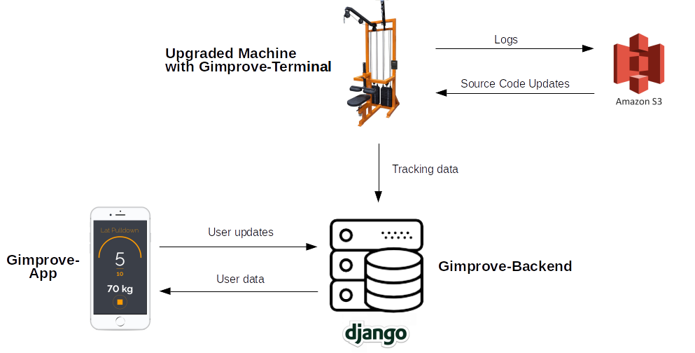

# Gimprove - Backend

## Project Overview
Gimprove is a lightweight system built to digitalize fitness equipment. Once installed on regular machines, Gimprove
allows users to automatically track all relevant keyfigures of their activities such as the number of repetitions
or the weight used. Users get feedback in realtime and can analyze their progress in the Gimprove App. For more 
information about Gimprove, visit the [Gimprove-Website](www.gimprove.com).

Here's an overview over the Gimprove system and it's components:
 

There are three respositories for this project:
1) [Gimprove Backend](https://bitbucket.org/den_mei/gimprove_backend/src/master/): 
Gimprove Plattform hosting the Gimprove Website and providing the Gimprove-API.

2) [Gimprove-App](https://bitbucket.org/den_mei/gimprove_app/src/master/): User Interface.

3) [Gimprove-Client](https://bitbucket.org/den_mei/gimprove_app/src/master/): Client that is attached on the machines.

## Repository Overview
This repository contains the code for the Gimprove-server. There are mutiple apps with different purposes:

1) **Landing Page:** Code for the [Gimprove-Landing Page](www.gimprove.com)

2) **app_main:** General models that can be used by the other apps.

3) **app_tracker:** Logic for the tracking system. Administration of users' tracking data.

4) **api_v`x`:** Rest-API with the version `x`. API-logic for all apps, implemented with the 
Django-Rest-Framework.

5) **app_network:** Logic for the Gimprove network that connects users and gym
s.

6) **app_achievements:** Logic for managing the users' achievements. Users can earn *achievements* e.g. by solving 
challenges or reaching predefined goals.

## Usage
To run the application locally, execute `python3 manage.py runserver`. The app will start to run under the following 
address: http://127.0.0.1:8000.

To test the tracker application, execute `python3 manage.py test tracker`.

### Build With
The Gimprove-backend is based on the Django-Framework. To realize the required services, 3rd party packages were used:

* [Django-Rest-Framework](http://www.django-rest-framework.org/) for the API used by our App and the clients

* [Django-Channels](https://github.com/django/channels) Websocket-Communication for live tracking between the client
and the App to achieve real-time communication.

### Contributing
**Dennis Meisner:** meisnerdennis@web.de

### Team Members
* **Lennard Rügauf:** l.ruegauf@gmx.de f(Business, Hardware)
* **Matthias Schuhbauer:** matthias_schuhbauer@web.de (Hardware)
* **Dennis Meisner:** meisnerdennis@web.de (Business, Software)
